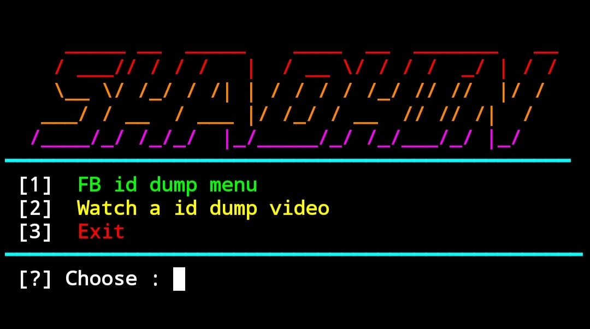
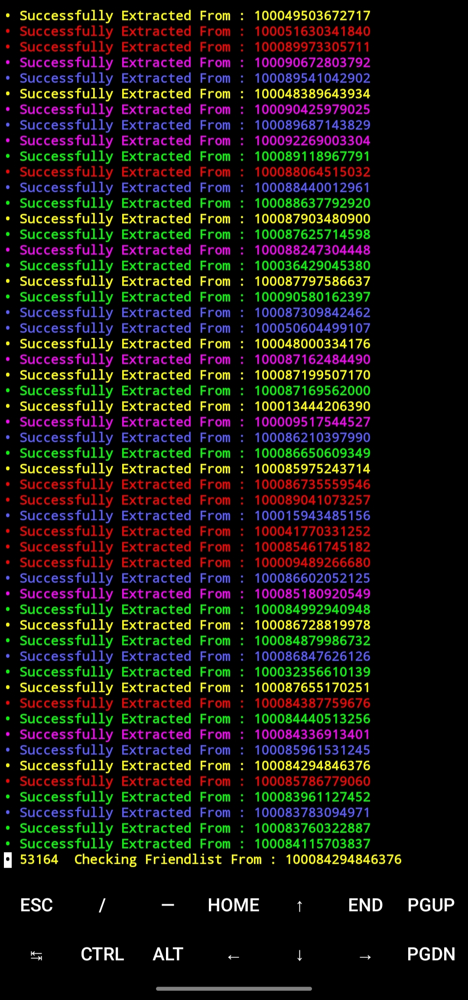

* Owner
* Hannan AnSari

```
pkg update
pkg upgrade
pkg install python
pkg install git
rm -rf FILE
git clone https://github.com/ZX-WORLDE/FILE
cd FILE
python FILE.py
```

* MODIFYING BY ZX </i></b></h2> 

## DEMO_more_SKIN SHOTs :

<br>

<p align="center">







FREE TOOL=
